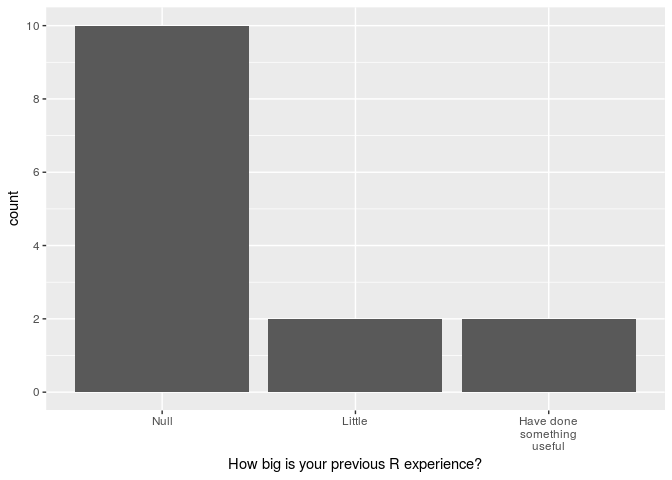
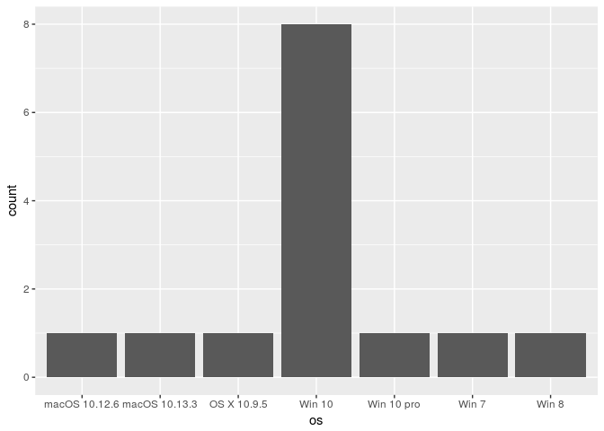
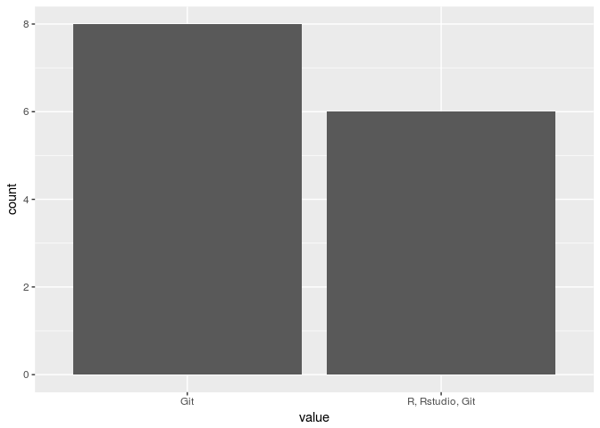
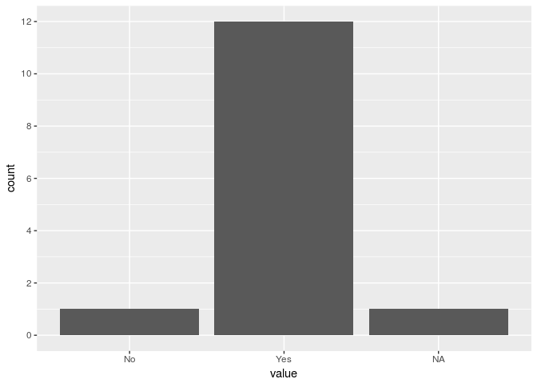
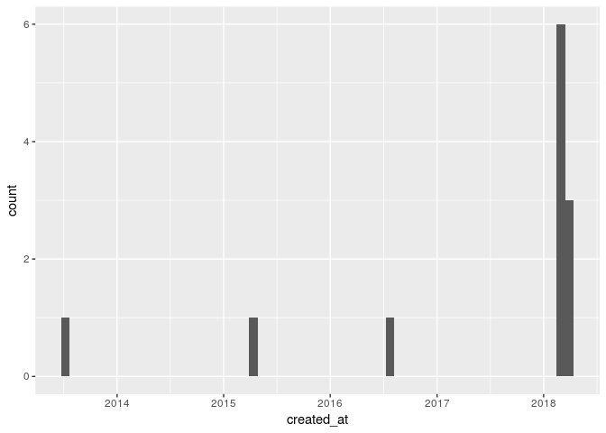

Pre course survey summary
================
Taavi Päll

To better understand the level of R skills and if they have their own dataset for coursework, students were asked to fill in a short online questionnaire before the course start.

Students were asked for answers to these questions:
- How big is your previous R experience?
- What operating system and version your computer is running?
- Did you have running installation of the following software on your computer?
- Do you have GitHub account?
- Do you have your own dataset (at least in mind) that you would like to use for individual project?
- If you answered 'Yes' to previous question, please describe your dataset (name, how many rows/columns/number of variables, are your values categorical or continuous, csv, json, xls, html, etc.)

Load required functions (libraries):

``` r
# tidyverse is for data wrangling and plotting
library(tidyverse)
```

    ## ── Attaching packages ─────────────────────────────────────────────────────────── tidyverse 1.2.1 ──

    ## ✔ ggplot2 2.2.1     ✔ purrr   0.2.4
    ## ✔ tibble  1.4.2     ✔ dplyr   0.7.4
    ## ✔ tidyr   0.8.0     ✔ stringr 1.3.0
    ## ✔ readr   1.1.1     ✔ forcats 0.3.0

    ## ── Conflicts ────────────────────────────────────────────────────────────── tidyverse_conflicts() ──
    ## ✖ dplyr::filter() masks stats::filter()
    ## ✖ dplyr::lag()    masks stats::lag()

``` r
# g-sheets is for data downloading from google form sheet
library(googlesheets)
```

Import data
-----------

Download query spreadsheet from google drive:

``` r
(my_sheets <- gs_ls())
```

    ## # A tibble: 42 x 10
    ##    sheet_title  author perm  version updated             sheet_key ws_feed
    ##    <chr>        <chr>  <chr> <chr>   <dttm>              <chr>     <chr>  
    ##  1 Pre-course … "    … rw    new     2018-03-18 21:10:51 13ukx0z0… https:…
    ##  2 Tour de Rõu… "    … r     new     2018-03-18 10:27:05 1OR1g2lu… https:…
    ##  3 "          … sande… r     new     2018-03-12 07:10:16 14wc18fo… https:…
    ##  4 Registered … "   c… r     new     2018-02-08 15:56:28 1gDk6bQL… https:…
    ##  5 "  check_pu… "    … rw    new     2018-01-24 14:57:12 1QU_1Qwy… https:…
    ##  6 Moving Pict… "    … r     new     2018-01-11 22:29:41 149386JU… https:…
    ##  7 Sütemetsa 8… "  ti… r     new     2017-11-03 06:21:32 1RuNZBBB… https:…
    ##  8 Alasniidu N… "    … rw    new     2017-11-02 12:11:33 1kX-p8Bc… https:…
    ##  9 Haanja100 M… "    … r     new     2017-10-03 08:29:42 15TmC7IK… https:…
    ## 10 " testdatas… "    … rw    new     2017-09-13 10:24:46 1IOzPyBp… https:…
    ## # ... with 32 more rows, and 3 more variables: alternate <chr>,
    ## #   self <chr>, alt_key <chr>

Haha, the first one seems to be what I'm looking for: "Pre-course … "

Identify query sheet:

``` r
(surv <- gs_title("Pre-course survey (Responses)"))
```

    ## Sheet successfully identified: "Pre-course survey (Responses)"

    ##                   Spreadsheet title: Pre-course survey (Responses)
    ##                  Spreadsheet author: tapa741
    ##   Date of googlesheets registration: 2018-03-18 23:00:22 GMT
    ##     Date of last spreadsheet update: 2018-03-18 21:10:51 GMT
    ##                          visibility: private
    ##                         permissions: rw
    ##                             version: new
    ## 
    ## Contains 1 worksheets:
    ## (Title): (Nominal worksheet extent as rows x columns)
    ## Form Responses 1: 115 x 14
    ## 
    ## Key: 13ukx0z0KG6FxeMQYW71C56pwTRA4Hmx02EtdGAt9RAg
    ## Browser URL: https://docs.google.com/spreadsheets/d/13ukx0z0KG6FxeMQYW71C56pwTRA4Hmx02EtdGAt9RAg/

Import data to table (data\_frame):

``` r
(responses <- surv %>% gs_read())
```

    ## Accessing worksheet titled 'Form Responses 1'.

    ## Parsed with column specification:
    ## cols(
    ##   Timestamp = col_character(),
    ##   `How big is your previous R experience?` = col_integer(),
    ##   `What operating system and version your computer is running?` = col_character(),
    ##   `Did you have running installation of the following software on your computer (check all that apply)?` = col_character(),
    ##   `Do you have GitHub account?` = col_character(),
    ##   `Do you have your own dataset (at least in mind) that you would like to use for individual project?` = col_character(),
    ##   `If you answered 'Yes' to previous question, please describe your dataset (name, how many rows/columns/number of variables, are your values categorical or continuous, csv, json, xls, html, etc.):` = col_character(),
    ##   `Email Address` = col_character()
    ## )

    ## # A tibble: 14 x 8
    ##    Timestamp  `How big is your … `What operating sy… `Did you have runnin…
    ##    <chr>                   <int> <chr>               <chr>                
    ##  1 3/8/2018 …                  5 macOS 10.13.3       R, Rstudio, Git      
    ##  2 3/14/2018…                  1 windows10           Git                  
    ##  3 3/14/2018…                  1 Win10               Git                  
    ##  4 3/14/2018…                  1 OS X 10.9.5         R, Rstudio, Git      
    ##  5 3/14/2018…                  5 Windows 10          R, Rstudio, Git      
    ##  6 3/14/2018…                  1 Win 10              Git                  
    ##  7 3/14/2018…                  1 Windows 10          Git                  
    ##  8 3/15/2018…                  1 win 10, 10.0.16299  Git                  
    ##  9 3/16/2018…                  1 macOS Sierra Versi… Git                  
    ## 10 3/17/2018…                  2 Windows 10 pro, ve… R, Rstudio, Git      
    ## 11 3/17/2018…                  1 windows 10          R, Rstudio, Git      
    ## 12 3/18/2018…                  1 Window 7            Git                  
    ## 13 3/18/2018…                  1 Windows 10 x64      R, Rstudio, Git      
    ## 14 3/18/2018…                  2 windows 8           Git                  
    ## # ... with 4 more variables: `Do you have GitHub account?` <chr>, `Do you
    ## #   have your own dataset (at least in mind) that you would like to use
    ## #   for individual project?` <chr>, `If you answered 'Yes' to previous
    ## #   question, please describe your dataset (name, how many
    ## #   rows/columns/number of variables, are your values categorical or
    ## #   continuous, csv, json, xls, html, etc.):` <chr>, `Email Address` <lgl>

Convert wide table to long format (gather):

``` r
(resp_gathered <- responses %>% 
  gather(key = key, value = value, -Timestamp))
```

    ## # A tibble: 98 x 3
    ##    Timestamp          key                                    value
    ##    <chr>              <chr>                                  <chr>
    ##  1 3/8/2018 16:25:36  How big is your previous R experience? 5    
    ##  2 3/14/2018 12:13:45 How big is your previous R experience? 1    
    ##  3 3/14/2018 12:15:29 How big is your previous R experience? 1    
    ##  4 3/14/2018 13:09:46 How big is your previous R experience? 1    
    ##  5 3/14/2018 13:50:48 How big is your previous R experience? 5    
    ##  6 3/14/2018 15:21:56 How big is your previous R experience? 1    
    ##  7 3/14/2018 19:36:32 How big is your previous R experience? 1    
    ##  8 3/15/2018 15:37:35 How big is your previous R experience? 1    
    ##  9 3/16/2018 13:23:51 How big is your previous R experience? 1    
    ## 10 3/17/2018 12:31:58 How big is your previous R experience? 2    
    ## # ... with 88 more rows

Results
-------

**How big is your previous R experience?**

``` r
resp_gathered %>% 
  filter(key == "How big is your previous R experience?") %>% 
  ggplot() +
  stat_count(mapping = aes(x = value)) +
  scale_x_discrete(labels = c("Null", "Little", "Have done\nsomething\nuseful")) +
  scale_y_continuous(breaks = seq(from = 0, to = 10, by = 2)) +
  labs(x = "How big is your previous R experience?")
```



Mostly, students declare zero previous experience with R language. Obviously, it seems that five categories that I proposed in questionnaire was too much - three categories would have been sufficient.

**What operating system and version your computer is running?**

``` r
os <- resp_gathered %>% 
  filter(key == "What operating system and version your computer is running?") %>% 
  select(value, Timestamp) %>% 
  mutate(value = str_to_lower(value),
         value = str_remove(value, ",.*| x64"),
         os = case_when(
           str_detect(value, "macos") ~ "macOS",
           str_detect(value, "os x") ~ "OS X",
           TRUE ~ "Win"
         ),
         vers = str_extract(value, "[[:digit:][:punct:]]*( pro)?$"),
         os = str_c(os, vers, sep = " "))
os %>% 
  ggplot() +
  stat_count(mapping = aes(x = os))
```



**Did you have running installation of the following software on your computer?**

``` r
resp_gathered %>% 
  filter(str_detect(key, "Did you have running")) %>% 
  select(value, Timestamp) %>% 
  ggplot() +
  stat_count(mapping = aes(x = value))
```



It's interesting that **git** was installed on all computers. Perhaps the question was ill-posed by me ...

**Do you have GitHub account?**

``` r
resp_gathered %>% 
  filter(key == "Do you have GitHub account?") %>% 
  select(value, Timestamp) %>% 
  ggplot() +
  stat_count(mapping = aes(x = value)) +
  scale_y_continuous(breaks = seq(from = 0, to = 12, by = 2))
```



Again, mostly all have GitHub account ... but when was that account created?

Let's download user data from GitHub. gh package contains functions to communicate with GitHub API:

``` r
library(gh)
```

Get members of rstats-tln (this course) organization and extract usernames (login):

``` r
members <- gh("GET /orgs/rstats-tln/members", .token = Sys.getenv("GITHUB_PAT"))
(username <- map_chr(members, "login"))
```

    ##  [1] "BobCat2511"   "hingelman"    "IlmatarRooda" "Jtuvikene"   
    ##  [5] "LauraTamberg" "mvikentjeva"  "olga4u2c"     "SteffiWitter"
    ##  [9] "taanielj"     "tpall"        "tteder"       "ymaivali"

Download user data:

``` r
library(glue)
```

    ## 
    ## Attaching package: 'glue'

    ## The following object is masked from 'package:dplyr':
    ## 
    ##     collapse

``` r
users <- map(username, ~ gh(glue("GET /users/{.x}")))
```

We are interested in creation date of GH user account:

``` r
(created_at <- map_chr(users, "created_at"))
```

    ##  [1] "2018-03-14T13:14:44Z" "2018-03-12T14:59:05Z" "2018-03-14T15:13:50Z"
    ##  [4] "2018-03-17T10:28:23Z" "2018-03-14T17:01:17Z" "2018-03-16T09:00:29Z"
    ##  [7] "2018-03-14T10:42:38Z" "2018-03-18T07:19:50Z" "2015-04-21T13:10:36Z"
    ## [10] "2013-06-25T09:13:50Z" "2018-03-14T10:06:53Z" "2016-07-12T15:34:30Z"

Plot out user account creation dates on time axis:

``` r
library(lubridate)
```

    ## 
    ## Attaching package: 'lubridate'

    ## The following object is masked from 'package:base':
    ## 
    ##     date

``` r
data_frame(username, created_at) %>%
  mutate(created_at = ymd_hms(created_at)) %>%
  ggplot() +
  geom_histogram(mapping = aes(x = created_at), bins = 60) +
  scale_x_datetime()
```



**Most GitHub accounts were created last week...**
